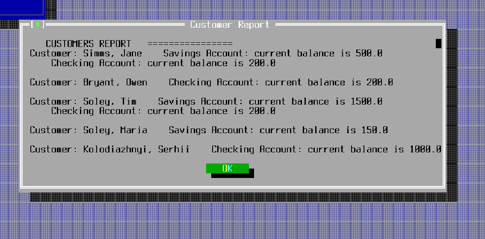
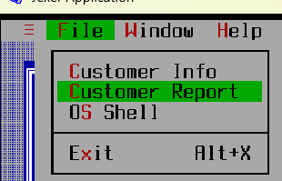
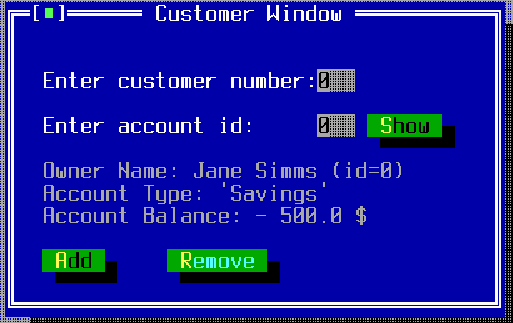
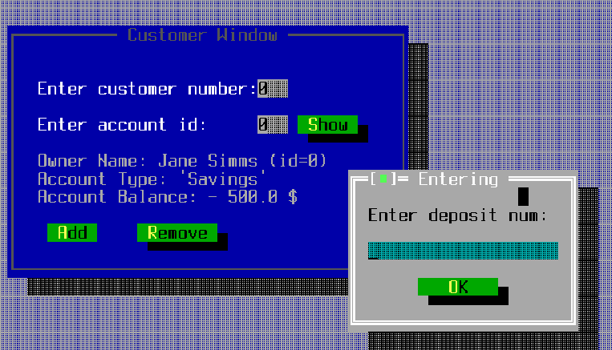
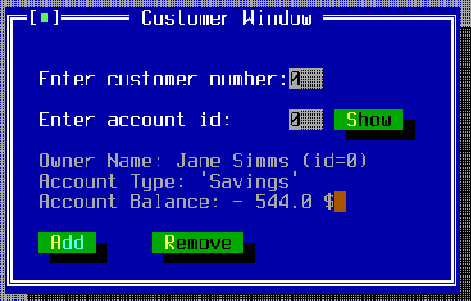
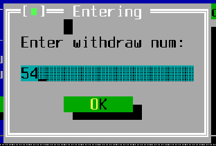
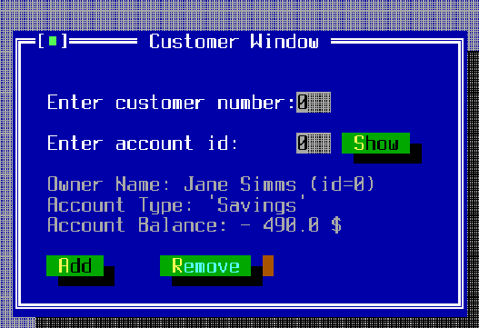

# UI Lab 1

## Код зчитування інформації
``` java
public static void main(String[] args) throws Exception {
        TUIdemo tdemo = new TUIdemo();
        //Loading data
        File currentClass = new File(URLDecoder.decode(TUIdemo.class
                .getProtectionDomain()
                .getCodeSource()
                .getLocation()
                .getPath(), "UTF-8"));
        String classDirectory = currentClass.getParent();
        new DataSource(classDirectory+"\\TUI-Lab1-Starter\\test.dat").loadData();
        Bank.addCustomer("Serhii","Kolodiazhnyi");
        Bank.getCustomer(Bank.getNumberOfCustomers()-1).addAccount(new CheckingAccount(1000,10));
        //Loading data
        (new Thread(tdemo)).start();
    }
```  
## Customer Report 
 

## Код
``` java
package com.mybank.tui;

import com.mybank.domain.*;

public class CustomerReport {
    private CustomerReport(){

    }

    public static String generateReport() {
        StringBuilder stringBuilder = new StringBuilder();
        stringBuilder.append("\t\t\tCUSTOMERS REPORT");
        stringBuilder.append("\t\t\t================");

        for(int cust_idx = 0; cust_idx < Bank.getNumberOfCustomers(); ++cust_idx) {
            Customer customer = Bank.getCustomer(cust_idx);
            stringBuilder.append("\n");
            stringBuilder.append("Customer: " + customer.getLastName() + ", " + customer.getFirstName());

            for(int acct_idx = 0; acct_idx < customer.getNumberOfAccounts(); ++acct_idx) {
                Account account = customer.getAccount(acct_idx);
                String account_type = "";
                if (account instanceof SavingsAccount) {
                    account_type = "Savings Account";
                } else if (account instanceof CheckingAccount) {
                    account_type = "Checking Account";
                } else {
                    account_type = "Unknown Account Type";
                }

                stringBuilder.append("    " + account_type + ": current balance is " + account.getBalance());
                stringBuilder.append("\n");
            }
        }
        return stringBuilder.toString();
    }
}

```

## Customer Window Adding



## Код всього Customer Window
``` java
private void ShowCustomerDetails() {
        TWindow custWin = addWindow("Customer Window", 2, 1, 40, 14, TWindow.NOZOOMBOX);
        custWin.newStatusBar("Enter valid customer number and press Show...");

        custWin.addLabel("Enter customer number: ", 2, 2);
        custWin.addLabel("Enter account id: ",2,4);
        TField accNo = custWin.addField(24,4,3,false);
        TField custNo = custWin.addField(24, 2, 3, false);
        TText details = custWin.addText("Owner Name: \nAccount Type: \nAccount Balance: ", 2, 6, 38, 18);
        custWin.addButton("&Show", 28, 4, new TAction() {
            @Override
            public void DO() {
                try {
                    int custNum = Integer.parseInt(custNo.getText());
                    int accNum = Integer.parseInt(accNo.getText());
                    Customer customer = Bank.getCustomer(custNum);
                    Account account = customer.getAccount(accNum);
                    String type;
                    if (account instanceof CheckingAccount){
                        type = "'Checking'";
                    }
                    else {
                        type = "'Savings'";
                    }
                    //details about customer with index==custNum
                    details.setText("Owner Name: "+customer.getFirstName()+" "+customer.getLastName()+" (id="+custNum+")\nAccount Type: "+type+"\nAccount Balance:"+" - "+account.getBalance()+" $\n");
                    custWin.addButton("&Add", 2, 10, new TAction() {
                        @Override
                        public void DO() {
                            TInputBox custNo = custWin.inputBox("Entering","Enter deposit num: ");
                            try{
                                account.deposit(Double.parseDouble(custNo.getText()));
                                messageBox("Success","Successfully added " +custNo.getText()+ " =)").show();
                                details.setText("Owner Name: "+customer.getFirstName()+" "+customer.getLastName()+" (id="+custNum+")\nAccount Type: "+type+"\nAccount Balance:"+" - "+account.getBalance()+" $\n");
                            }
                            catch (Exception e){
                                messageBox("Error","Not number or minus number").show();
                            }
                        }
                    });
                    custWin.addButton("&Remove", 12, 10, new TAction() {
                        @Override
                        public void DO() {
                            TInputBox custNo = custWin.inputBox("Entering","Enter withdraw num: ");
                            try{
                                account.withdraw(Double.parseDouble(custNo.getText()));
                                messageBox("Success","Successfully removed - "+custNo.getText()+" =)").show();
                                details.setText("Owner Name: "+customer.getFirstName()+" "+customer.getLastName()+" (id="+custNum+")\nAccount Type: "+type+"\nAccount Balance:"+" - "+account.getBalance()+" $\n");
                            }
                            catch (Exception e){
                                messageBox("Error","Not number or minus number").show();
                            }
                        }
                    });
                } catch (Exception e) {
                    messageBox("Error", "You must provide a valid customer number and account!").show();
                }
            }
        });
    }
```
## Код тільки додавання до балансу
``` java
custWin.addButton("&Add", 2, 10, new TAction() {
    @Override
    public void DO() {
        TInputBox custNo = custWin.inputBox("Entering","Enter deposit num: ");
        try{
            account.deposit(Double.parseDouble(custNo.getText()));
            messageBox("Success","Successfully added " +custNo.getText()+ " =)").show();
            details.setText("Owner Name: "+customer.getFirstName()+" "+customer.getLastName()+" (id="+custNum+")\nAccount Type: "+type+"\nAccount Balance:"+" - "+account.getBalance()+" $\n");
        }
        catch (Exception e){
            messageBox("Error","Not number").show();
        }
    }
});
```
## Віднімання балансу


## Код тільки віднімання до балансу
``` java
custWin.addButton("&Remove", 12, 10, new TAction() {
    @Override
    public void DO() {
        TInputBox custNo = custWin.inputBox("Entering","Enter withdraw num: ");
        try{
            account.withdraw(Double.parseDouble(custNo.getText()));
            messageBox("Success","Successfully removed - "+custNo.getText()+" =)").show();
            details.setText("Owner Name: "+customer.getFirstName()+" "+customer.getLastName()+" (id="+custNum+")\nAccount Type: "+type+"\nAccount Balance:"+" - "+account.getBalance()+" $\n");
        }
        catch (Exception e){
            messageBox("Error","Not number").show();
        }
    }
});
```